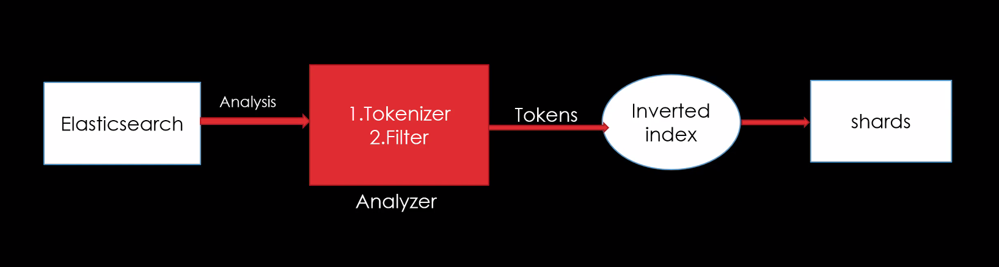

- distributed, real-time, open source, full-text search and analysis engine
- can be used for data exploration/building dashboards
- on top of apache lucene

## Querys

- RESTful APIs
- json

Interact with elasticsearch through kibana

## Logstash

data processing pipeline.

Receive data in events, processed by logstash to be shipped to elasticsearch

input sources are called _beats_


## Nodes

- master
- data
- ingest
- coordinate
  - fetch results faster
- ML

Sharding
- replica in a separate node
- zero configuration

- yellow: some nodes not set up properly
- red: big sad

# Basic operations

listing all indices
```
GET _cat/indices
```
# CRUD

update -> replace the whole document
update -> update only one field -> some other PUT query

POST emp/_doc/_delete_by_query
{
    ...
    {
        "_id" : "..",
    }
}

- bulk upload

## Create 

auto create
```
POST courses/_create # "course" as <target>
{
  "name": "another course",
  "room": "Zoom",
  "professor": {},
  "students_enrolled": 1
}
```
> This will generate a new document in the index, with a string id

- reindex
  - is a copying rather than a moving operation
 ```
POST _reindex
{
  "source": {
    "index": "courses"
  },
  "dest": {
    "index": "my-courses"
  }
}
 ``` 



standard analyzer
- lowercase, whitespace, special characters

simple 
- standard but removes numerals as well

whitespace
- split(" ")

stop
- removes words like "a", "an", "that" that are insignifcant in NLP

keyword
- exact match

fingerprint
- analyzer
- removes duplicate words

```
GET {index}/_analyze
{
  "field": "{prop}"
  "text": "{some long string}"
}
```

## Mapping

- Dynamic mapping
- Explicit mapping
- Index templates

Mappings define the field datatypes for your index.
Each property may also only have 1 type
You may insert data with or without properties, for new properties, Elasticsearch will generate a dynamic mapping.
After a mapping is defined, it cannot be changed.

However a new property mapping can be added

```
PUT index/_mapping 
{
  "properties": {
    "new_field": {
      "type": type
    }
  }
}
```

### Property types

- keyword
  - ! keywords are not stored in the reverse index

nested properties can use the dot notation.

post dot notation = GET results will be different, but functionally is the same

### Reindex

Change the mappings

> Source data will never change, new mapping only enforces the data for new incoming data.

```
// create a new index
PUT index 
{
  "mappings": {
    ...
  }
}

// _reindex

POST _reindex
{
  "source": {
    "index": old
    "_source": ["property1", "property2"] // (only certain fields)
  },
  "dest": {
    "index": new
  }
}
```

Rename a field with alias

```
PUT index/_mapping
{
  "properties": {
    newprop: {
      "type": "alias",
      "path": oldprop
    }
  }
}
```
### Index Templates

a way to tell elastic search how to configure an index when it is created

create
```
PUT _template/access-logs
{
  "index-patterns": ["access-logs-*"]
}
```

```
GET _cat/shards?v
```

Retrieve all templates
```
GET _cat/templates
```
Get a template
```
GET _templates/access-logs
```

> Multiple template match will union non-conflicting fields, and ignore conflicting fields

### Dynamic mapping

arrays -> keyword
numerals -> long

```
PUT {index}
{
  "mappings": {
    "dynamic": {false, "strict"},
    "properties": {
      ...
    }
  }
}
```

Deleting a template
```
DELETE _template/{template_name}
```

> set dynamic to "strict" instead of false, mix mappings to conserve space and etc.
> strict -> reject field when indexing the document
> false -> not reject but it will be hard to explain when querying

> Elastic Common Schema

## Query DSL

```
GET courses/_search 
{
  "query": {
    "match": {
      "name": "accounting"
    }
  }
}

GET courses/_search?q=name:accounting
GET courses/_search?q=*
GET courses/_search?q=room:c8
GET courses/_search?q=room:c8 OR name:computer
```
query with URI or JSON

### Match all

```
GET products/_search?q=*
```

```
GET products/_search
{
  "query": {
    "match_all": {}
  }
}
```

Complex boolean logic
```
GET courses/_search 
{
  "query": {
    "bool": {
      "must_not": [
        {
          "match": {
            "name": "computer"
          }
        }
      ],
      "must": [
        {
          "match": {
            "name": "accounting"
          }
        }
      ]
    }
  }
}
```

Node becomes coordinating node.
Coordinating node sends the request to shards.
Results merged back by coordinating node.
Return to user.


## Term search

```
GET products/_search
{
  "query": {
    "term": {
      "name": {
        "value": "lobster"
      }
    }
  }
}
```
> for numeric and dates

exact search in reverse-index.
Need to pay attention to casing or use "keyword" for uppercasing.

### Get particular document

```
GET products/_search
{
  "query": {
    "ids": {
      "values": [2, 56, 89, 4]
    }
  }
}
```

### Range query

```
GET products/_search
{
  "query": {
    "range": {
      "in_stock": {
        "gte": 10,
        "lte": 20
      }
    }
  }
}
```

```
GET products/_search
{
  "query": {
    "range": {
      "created": {
        "gte": "2010/01/01",
        "lte": "2010/12/12",
        ["format": "dd-MM-yyyy"] # custom date format
        ["gte": "now-5y"] # today shorthand and timedelta
      }
    }
  }
}
```

prefix: any document whose name start with
```
GET products/_search
{
  "query": {
    "prefix": {
      "name": {
        "value": "pas",
      }
    }
  }
}
```

wildcard, kleene star
```
GET products/_search
{
  "query": {
    "wildcard": {
      "name": {
        "value": "pas?a", # single character
        "value": "pas*", # any 
      }
    }
  }
}
```

regex
```
GET products/_search
{
  "query": {
    "regexp": {
      "name": "pas[a-zA-Z]a"
    }
  }
}
```

multimatch
```
GET products/_search
{
  "query": {
    "multi-match": {
      "name": ""
      "fields": ["title", "description"]
    }
  }
}
```

## Complex query

```
GET recipe/_search
{
  "query": {
    "bool": {
      "must": [ # highest priority
        {
          "match": {
            "ingredients.name": "parmesan"
          }
        }
      ],
      "must_not": [ # exclude condition
        {
          "match": {
            "ingredients.name": "tuna"
          }
        }
      ], 
      "should": [ # becomes optional in the prescence of "must", acts like a "must" otherwise
        {
          "match": {
            "ingredients.name": "parsley"
          }
        }
      ],
      "filter": [ # within the scope of the bool object
        {
          "range": {
            "preparation_time_minutes": {
              "lte": 15
            }
          }
        }
      ]
    }
  }
}
```

## Aggregations

```
GET order/_search
{
  "size": 0, # hide the sample documents
  "aggs": {
    "total_sales": { # custom label for the aggregation
      "sum": { # summation ["sum", "avg", "max", "min"]
        "field": "total_amount" # field in the document
      }
    },
    "count_distinct": {
      "cardinality": { # basically distinct
        "field": "salesman.id"
      }
    },
    "count_rows": {
      "value_count": { # just count rows
        "field": "salesman.id"
      }
    },
    "statistics": {
      "stats": { # count, sum, avg, max, min in 1 object
        "field": "total_amount"
      }
    }
  }
}
```

> mapping is generally needed, 
> text fields are not optimized for aggregation operations

bucket aggregation
```
GET order/_search
{
  "size": 0, # hide the sample documents
  "aggs": {
    "status": { # custom label for the aggregation
      "terms": { # creates buckets, like group by in sql
        "field": "status.keyword" # field in the document
      },
      "aggs": {
        "count_distinct": { # child aggregation
          "cardinality": { # basically distinct
            "field": "salesman.id"
          }
        },
      }
    },
  }
}
```

prefilter query
```
GET order/_search
{
  "size": 0, # hide the sample documents
  "query": {
    "range": {
      "total_amount": {
        "gte": 100
      }
    }
  },
  "aggs": { # aggregation will now only apply on query results
    "status": { 
      "terms": {
        "field": "status.keyword" 
      },
      "aggs": {
        "count_distinct": { 
          "cardinality": { 
            "field": "salesman.id"
          }
        },
      }
    },
  }
}
```

```
GET order/_search
{
  "size": 0, # hide the sample documents
  "aggs": { 
    "lower_value": { # filter label
      "filter": { # apply the filter as part of agg object
        "range": {
          "total_amount": {
            "lte": 50
          }
        }
      }
    },
    "aggs": {
      "label": { # label
        "avg": { 
          "field": "amount"
        }
      },
    }
  }
}
```

range buckets

```
GET order/_search
{
  "size": 0, # hide the sample documents
  "aggs": { 
    "amt_dist": { # distribution label
      "range": { # aggregation type
        "field": "amount",
        "ranges": { # ranges
          [{
            "to" : 50
          }, {
            "from": 50,
            "to": 100
          }, {
            "from": 100
          }]
        }
      }
    },
    "aggs": {
      "label": { # label
        "avg": { 
          "field": "amount"
        }
      },
    }
  }
}
```
